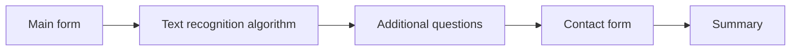

# Public

The Public application allows the general public to create nuisance reports.

This is the general flow of the app:

## Getting started

Run `npm run dev:public` in the root directory to start the Public app.
