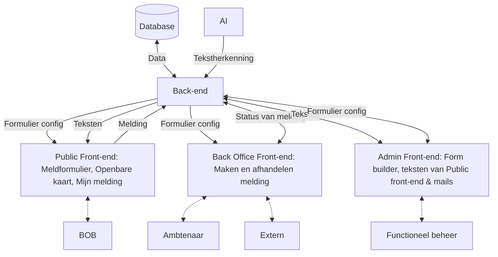

<!-- @license CC0-1.0 -->

# Meldingen front-end architecture

Meldingen is an application with three separate front-ends:

- Public: where the general public can create nuisance reports.
- Back Office: where professionals can handle these reports.
- Admin: where admins can manage the Public and Back Office apps.

## Further documentation

1. [Libraries and frameworks](./0001-libraries-and-frameworks.md)
2. [Type safety](./0002-type-safety.md)
3. [Testing](./0003-testing.md)
4. [Styling](./0004-styling.md)
5. [Linting](./0005-linting.md)
6. [Monorepo tooling](./0006-monorepo-tooling.md)
7. [Forms](./0007-forms.md)
8. [Authentication](./0008-authentication.md)
9. [Directory structure](./0009-directory-structure.md)
10. [Progressive enhancement](./0010-progressive-enhancement.md)
