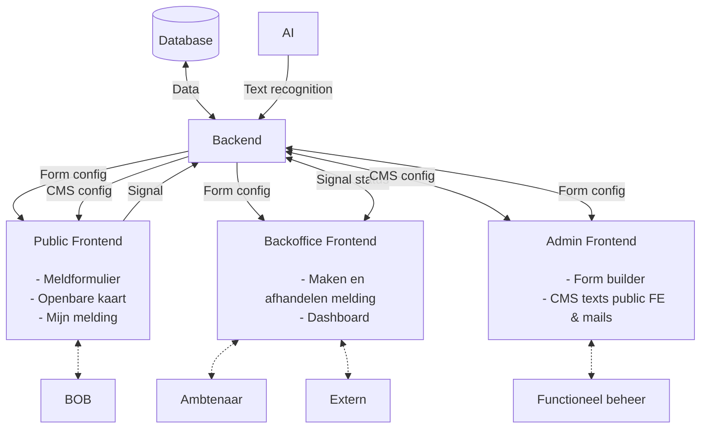

<!-- @license CC0-1.0 -->

# Meldingen front-end architecture

Meldingen is an application with three separate front-ends:

- Public: where the general public can create notifications.
- Backoffice: where professionals can handle these notifications.
- Admin: where admins can manage the Public and Backoffice apps.

## Further documentation

1. [Library and framework](./0001-library-and-framework.md)
2. Typescript
3. Testing
4. Styling
5. Linting
6. Monorepo tooling
7. Authentication
