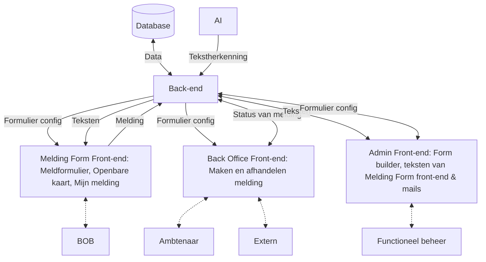

<!-- @license CC0-1.0 -->

# Meldingen front-end architecture

Meldingen is an application with three separate front-ends:

- Melding Form: where the general public can create nuisance reports.
- Back Office: where professionals can handle these reports.
- Admin: where admins can manage the Melding Form and Back Office apps.

```mermaid
graph TD
    DB[("Database")] <-->|Data| BE["Back-end"]
    AI -->|Tekstherkenning| BE
    BE -->|Formulier config| MFE["Melding Form Front-end: Meldformulier, Openbare kaart, Mijn melding"]
    MFE -->|Melding| BE
    BE -->|Formulier config| BFE["Back Office Front-end: Maken en afhandelen melding"]
    BE -->|Teksten| MFE
    BE <-->|Status van melding| BFE
    BE <-->|Teksten| AFE["Admin Front-end: Form builder, teksten van Melding Form front-end & mails"]
    BE <-->|Formulier config| AFE
    MFE <-.-> BOB
    BFE <-.-> AMBT["Ambtenaar"]
    BFE <-.-> EXT["Extern"]
    AFE <-.-> FB["Functioneel beheer"]
```
